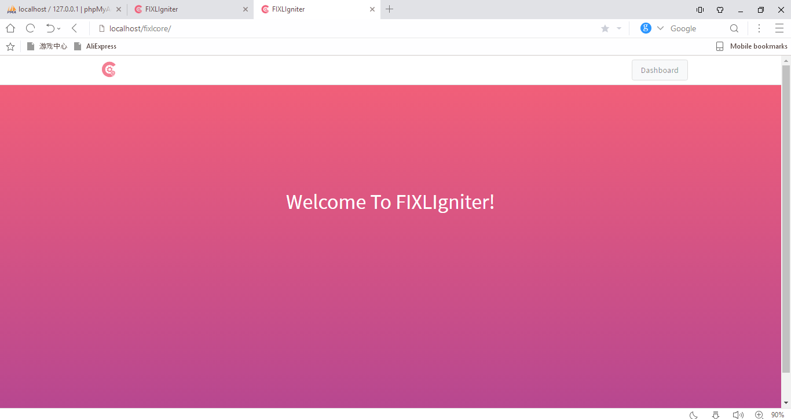
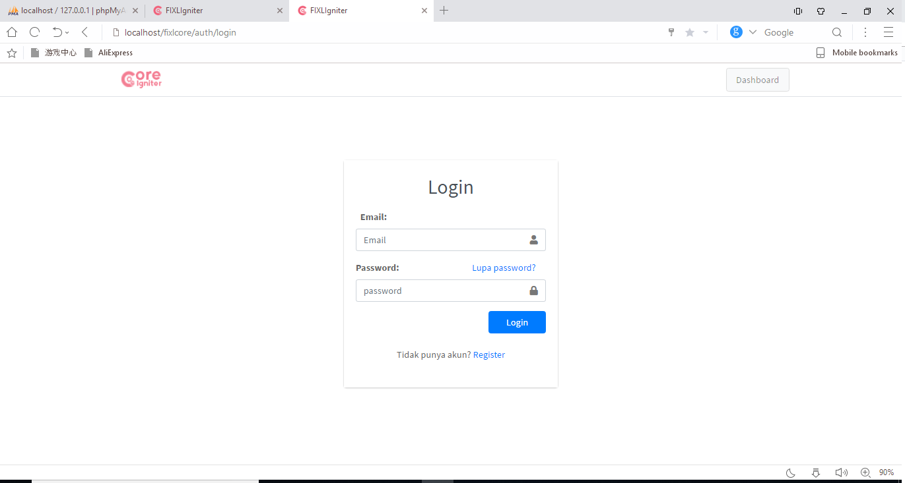
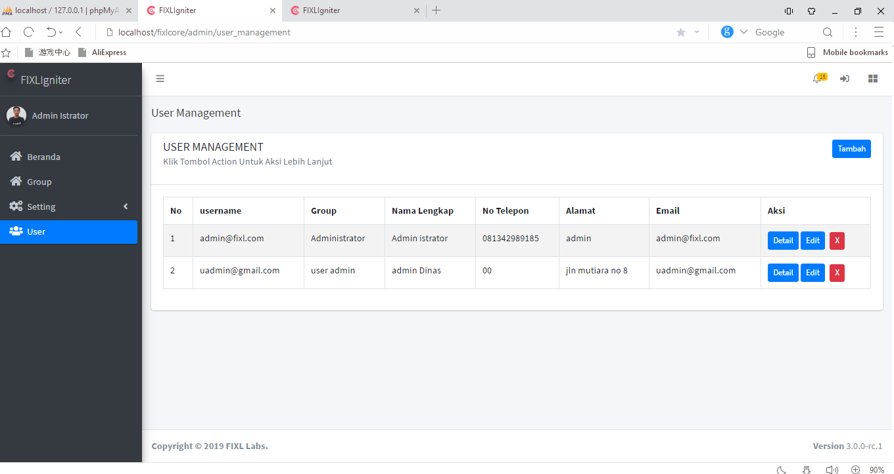
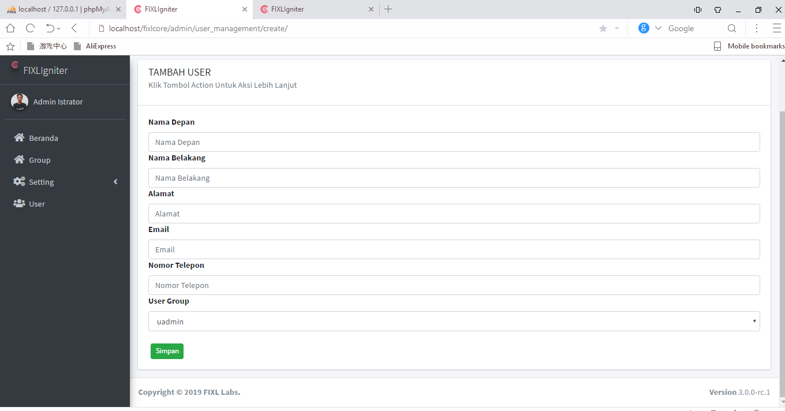

## Fixlcore

repo ini adalah starter untuk membuat aplikasi yang merupakan framework CodeIgniter yang telah ditambahkan beberapa library 
1. ion auth ( untuk login dan register serta user management )
2. rest api ( untuk membuat service API )


<b> kelebihan dari core ini adalah adanya template untuk meng-generate widget seperti tabel, modal, form. </b>

berikut contohnya 
# 1. pembuatan tabel

```
  public function get_table_config( $_page, $start_number = 1 )
  {
	// sesuaikan nama tabel header yang akan d tampilkan dengan nama atribut dari tabel yang ada dalam database
	    $table["header"] = array(
				'username' => 'username',
				'group_name' => 'Group',
				'user_fullname' => 'Nama Lengkap',
				'phone' => 'No Telepon',
				'address' => 'Alamat',
				'email' => 'Email',
			  );
	  $table["number"] = $start_number ;
	  $table[ "action" ] = array(
		array(
		  "name" => "Detail",
		  "type" => "link",
		  "url" => site_url($_page."detail/"),
		  "button_color" => "primary",
		  "param" => "id",
		),
		array(
		  "name" => "Edit",
		  "type" => "link",
		  "url" => site_url($_page."edit/"),
		  "button_color" => "primary",
		  "param" => "id",
		),
		array(
		  "name" => 'X',
		  "type" => "modal_delete",
		  "modal_id" => "delete_category_",
		  "url" => site_url( $_page."delete/"),
		  "button_color" => "danger",
		  "param" => "id",
		  "form_data" => array(
			"id" => array(
			  'type' => 'hidden',
			  'label' => "id",
			),
			"group_id" => array(
			  'type' => 'hidden',
			  'label' => "group_id",
			),
		  ),
		  "title" => "User",
		  "data_name" => "user_fullname",
		),
	);
    return $table;
  }
  
```
- code diatas di simpan di dalam folder ``library`` yang kemudian di panggil dalam controller
```
//code dalam kontroller

$table = $this->services->get_table_config( $this->current_page ); // 
$table[ "rows" ] = $this->ion_auth->users_limit( $pagination['limit_per_page'], $pagination['start_record']  )->result(); 
$table = $this->load->view('templates/tables/plain_table', $table, true);
$this->data[ "contents" ] = $table; // variabel ini akan di kirim kedalam view
$this->render( "templates/contents/plain_content" );

```
- potongan code dalam view 
```
         </div>
            </div>
            <div class="card-body">
              <!--  -->
              <?php echo (isset($contents)) ? $contents : '';  ?> // ini akan menampilkan tabel
              <!--  -->
              <!--  -->
              <?php echo (isset($pagination_links)) ? $pagination_links : '';  ?>
              <!--  -->
            </div>
          </div>
        </div>
```
- hasil 


<b> jadi kita tidak perlu lagi membuat html tabel, apa lagi sampai bermacam- macam tabel </b>

# 2. pembuatan form
```
public function get_form_data_readonly( $user_id = -1 )
{
	if( $user_id != -1 )
	{
		$user 				= $this->ion_auth_model->user( $user_id )->row();
		$this->identity		=$user->username;
		$this->first_name	=$user->first_name;
		$this->last_name	=$user->last_name;
		$this->phone		=$user->phone;
		$this->id			=$user->user_id;
		$this->email		=$user->email;
		$this->group_id		=$user->group_id;
		$this->address		=$user->address;

	}

	$groups =$this->ion_auth_model->groups(  )->result();
	$group_select = array();
	foreach( $groups as $group )
	{
		// if( $group->id == 1 ) continue;
		$group_select[ $group->id ] = $group->name;
	}

	$_data["form_data"] = array(
		"id" => array(
			'type' => 'hidden',
			'label' => "ID",
			'value' => $this->form_validation->set_value('id', $this->id),
		  ),
		"first_name" => array(
		  'type' => 'text',
		  'label' => "Nama Depan",
		  'value' => $this->form_validation->set_value('first_name', $this->first_name),
		),
		"last_name" => array(
		  'type' => 'text',
		  'label' => "Nama Belakang",
		  'value' => $this->form_validation->set_value('last_name', $this->last_name),
		),
		"email" => array(
		  'type' => 'text',
		  'label' => "Email",
		  'value' => $this->form_validation->set_value('email', $this->email),			  
		),
		"address" => array(
			'type' => 'text',
			'label' => "Alamat",
			'value' => $this->form_validation->set_value('address', $this->address),			  
		  ),
		"phone" => array(
		  'type' => 'number',
		  'label' => "Nomor Telepon",
		  'value' => $this->form_validation->set_value('phone', $this->phone),			  
		),
		"group_id" => array(
			'type' => 'text',
			'label' => "User Group",
			'value' => $group_select[ $this->group_id ],
		),
	  );
	return $_data;
}
```
- code diatas di simpan di dalam folder ``library`` yang kemudian di panggil dalam controller
```
//code dalam kontroller
 $form_data = $this->ion_auth->get_form_data();
$form_data = $this->load->view('templates/form/plain_form', $form_data , TRUE ) ;

$this->data[ "contents" ] =  $form_data;
```
- potongan code dalam view 
```
         </div>
            </div>
            <div class="card-body">
              <!--  -->
              <?php echo (isset($contents)) ? $contents : '';  ?> // ini akan menampilkan tabel
              <!--  -->
              <!--  -->
              <?php echo (isset($pagination_links)) ? $pagination_links : '';  ?>
              <!--  -->
            </div>
          </div>
        </div>
```
- Hasil 


untuk menelusurinya lebih dalam, silahkan download repositorinya :)

